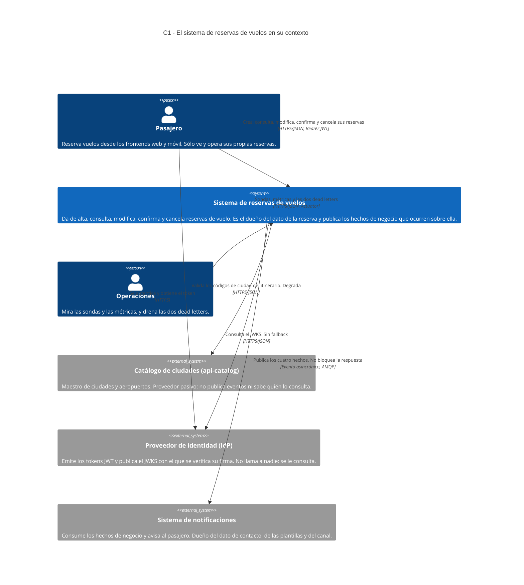
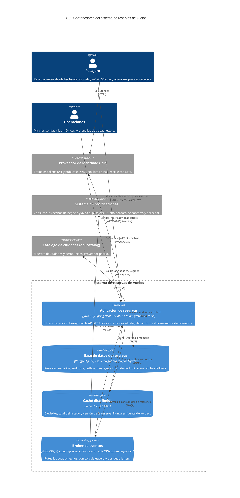

# Diagramas C4 — Contexto y Contenedores

Los dos primeros niveles del [modelo C4](https://c4model.com) del sistema de
reservas de vuelos, en Mermaid, versionados junto al código.

- §1 [Elementos](#1-elementos)
- §2 [Relaciones](#2-relaciones)
- §3 [C1 — Diagrama de Contexto](#3-c1--diagrama-de-contexto)
- §4 [C2 — Diagrama de Contenedores](#4-c2--diagrama-de-contenedores)
- §5 [Notas del diagrama](#5-notas-del-diagrama)
- §6 [Qué queda fuera, a propósito](#6-qué-queda-fuera-a-propósito)
- §7 [Dónde vive esto](#7-dónde-vive-esto)

Los diagramas describen **lo que el código tiene hoy**. Nada de lo que está
dibujado es una intención: lo que se evaluó y no se hizo está en
[`alternativas-descartadas.md`](../adr/alternativas-descartadas.md) y lo que falta,
en [Fuera de alcance](../../README.md#fuera-de-alcance).

---

## 1. Elementos

Las tablas son la fuente del diagrama, no su resumen: primero se listan los
elementos y sus relaciones, después se dibujan. Es lo que permite verificar que
el dibujo no inventó nada y que los dos niveles no se contradicen.

| Nombre | Tipo | Tecnología | Responsabilidad | Nivel |
|---|---|---|---|---|
| **Pasajero** | Persona | Frontends web y móvil | Da de alta, consulta, modifica, confirma y cancela **sus** reservas. Nunca ve las de otro: la política de acceso es del dominio ([0003](../adr/0003-autenticacion-autorizacion-y-datos-sensibles.md)) | C1 y C2 |
| **Operaciones** | Persona | Consola, `curl`, tablero | Mira las sondas y las métricas, y drena las **dos** dead letters: la del productor (`outbox`) y la del consumidor (`messaging-dlq`) | C1 y C2 |
| **Sistema de reservas de vuelos** | Sistema (el que se describe) | Java 21, Spring Boot 3.5, arquitectura hexagonal | Dueño del dato de la reserva. Valida el itinerario, aplica la concurrencia optimista, registra la auditoría y publica los cuatro hechos de negocio | C1 (como caja única); en el C2 es la frontera que encierra a los cuatro contenedores |
| **Proveedor de identidad (IdP)** | Sistema externo | OAuth2 / OIDC, JWKS | Emite los tokens JWT y publica el juego de claves con el que se verifica su firma. **No llama a nadie**: se le consulta | C1 y C2 |
| **Catálogo de ciudades (`api-catalog`)** | Sistema externo | API REST/JSON | Maestro de ciudades y aeropuertos. Proveedor pasivo: no publica eventos ni sabe quién lo consulta ([0009](../adr/0009-integracion-con-el-catalogo-externo.md)) | C1 y C2 |
| **Sistema de notificaciones** | Sistema externo | Consumidor AMQP | Consume los hechos de negocio y avisa al pasajero. Dueño del dato de contacto, de las plantillas y del canal. **No lo llama nadie de forma síncrona** | C1 y C2 |
| **Aplicación de reservas** | Contenedor | Java 21, Spring Boot 3.5 — API en `8080`, gestión en `9090` | Un único proceso: API REST `/v1/reservations`, casos de uso, relay del outbox por `@Scheduled` y el consumidor de referencia de la mensajería | C2 |
| **Base de datos de reservas** | Contenedor | PostgreSQL 17, esquema gobernado por Flyway ([0006](../adr/0006-el-esquema-lo-gobierna-flyway.md)) | Reservas, usuarios, auditoría, la tabla `outbox_message` y el inbox de deduplicación. Es el sistema de registro | C2 |
| **Caché distribuida** | Contenedor | Redis 7 — **opcional** ([0010](../adr/0010-cache-distribuida-opcional-con-fallback-en-memoria.md)) | Ciudades del catálogo, total del listado y versión de la reserva. Nunca es fuente de verdad y no guarda PII ([0011](../adr/0011-alcance-de-la-cache.md)) | C2 |
| **Broker de eventos** | Contenedor | RabbitMQ 4 — topic exchange `reservations.events` ([0004](../adr/0004-mensajeria-asincronica-y-broker.md)) | Rutea los cuatro hechos por *routing key* hacia la cola del consumidor, con cola de espera y dos dead letters | C2 |

**Cómo se llama cada cosa en el resto de la documentación.** El nombre del
elemento es su rol; el producto va en la tecnología, que es donde lo nombran los
ADR, la [topología de mensajería](../messaging/topology.md) y el código:

| En el diagrama | En los ADR, la topología y el código |
|---|---|
| Base de datos de reservas | PostgreSQL, y sus tablas: `reserva`, `usuario`, `auditoria`, `outbox_message`, `processed_message` |
| Caché distribuida | Redis, `CacheStore`, `RedisCacheStore` |
| Broker de eventos | RabbitMQ, el *broker*, `reservations.events` |
| Aplicación de reservas | `flight-reservations`, `reservations-api` |
| Catálogo de ciudades (`api-catalog`) | `api-catalog`, el catálogo externo, `AirportCatalogPort` |

---

## 2. Relaciones

| # | Origen | Destino | Qué viaja | Protocolo | ¿Opcional o degrada? | Nivel |
|---|---|---|---|---|---|---|
| 1 | Pasajero | Proveedor de identidad (IdP) | Se autentica y obtiene un token JWT | HTTPS | No | C1 y C2 |
| 2 | Pasajero | Sistema de reservas / Aplicación de reservas | Alta, lectura, listado, modificación, confirmación y cancelación. `Idempotency-Key` en el alta, `ETag` / `If-Match` en las escrituras ([0008](../adr/0008-concurrencia-optimista-e-idempotencia-en-el-protocolo.md)) | HTTPS/JSON, `Bearer` JWT | No: es el camino del pedido | C1 y C2 |
| 3 | Operaciones | Sistema de reservas / Aplicación de reservas | Sondas, métricas y los endpoints `outbox` y `messaging-dlq` (inspección y replay) | HTTPS/JSON — Actuator, puerto de gestión `9090`, con token | No | C1 y C2 |
| 4 | Sistema de reservas / Aplicación de reservas | Proveedor de identidad (IdP) | Consulta del JWKS para verificar firma, expiración, emisor y audiencia | HTTPS/JSON | **No hay fallback**: sin JWKS el pedido falla. Aceptar un token sin validarlo no es degradar ([0013](../adr/0013-degradacion-explicita-y-visible.md)) | C1 y C2 |
| 5 | Sistema de reservas / Aplicación de reservas | Catálogo de ciudades (`api-catalog`) | Validación de los códigos de ciudad del itinerario, en cada `POST` y `PUT` | HTTPS/JSON — `GET /city/{code}` | **Degrada**: caché, reintentos sobre el `GET` y *stale-while-error* sólo con entradas positivas; sin nada guardado, `503 AIRPORT_CATALOG_UNAVAILABLE` con `Retry-After` | C1 y C2 |
| 6 | Sistema de reservas | Sistema de notificaciones | Los cuatro hechos: `reservation.created`, `.confirmed`, `.modified`, `.cancelled` | Evento asincrónico — AMQP | **No bloquea la respuesta**: el hecho se compromete en el outbox dentro de la transacción y sale después | C1 (en C2 es el par 9 + 11) |
| 7 | Aplicación de reservas | Base de datos de reservas | Reservas, usuarios, auditoría, `outbox_message` e inbox de deduplicación | JDBC — pool de 20, `statement_timeout` de 2 s | **No hay fallback**: es el sistema de registro. Si no está, el pedido falla | C2 |
| 8 | Aplicación de reservas | Caché distribuida | Ciudades del catálogo, total del listado y versión de la reserva | RESP (Redis) — *timeout* de 200 ms | **Opcional y degradable**: apagable por configuración y, ante *timeout* o circuito abierto, el mismo código usa el almacén en memoria del proceso o va al origen | C2 |
| 9 | Aplicación de reservas (relay del outbox) | Broker de eventos | **Publica** los cuatro hechos al exchange, con el tipo como *routing key*, `mandatory` y *publisher confirms* | AMQP 0-9-1 | **Degrada**: sin broker los hechos se acumulan en `outbox_message` y el relay reintenta. Lo que agota reintentos queda como dead letter **en la base**, no en el broker | C2 |
| 10 | Broker de eventos | Aplicación de reservas (consumidor de referencia) | **Recibe** de la cola `notifications.reservation-events` y registra la entrega | AMQP 0-9-1 | **Opcional**: apagable (`reservations.messaging.consumer-enabled`); es el consumidor de referencia del repositorio, no el destinatario real | C2 |
| 11 | Broker de eventos | Sistema de notificaciones | **Entrega** los hechos ruteados por `reservation.*` a la cola del consumidor | AMQP 0-9-1 | *At-least-once*: `ack` recién después de procesar; lo que no se pudo procesar va a la DLQ del consumidor | C2 |

Las relaciones 6, 9 y 11 son la misma cosa vista en dos niveles: en el C1 el
sistema publica un hecho y el de notificaciones lo recibe; en el C2 se ve que en
el medio está el broker y que el productor **no nombra a ningún destinatario**.

---

**Las etiquetas del dibujo son la versión corta.** En el diagrama cada flecha
dice qué viaja y sobre qué protocolo en una línea; el detalle —el header, el
escalón de degradación, el timeout— está en la fila correspondiente de esta
tabla. Lo que no puede pasar es que digan cosas distintas.

---

## 3. C1 — Diagrama de Contexto

## 4. C2 — Diagrama de Contenedores

---

## 5. Notas del diagrama

Lo que el dibujo no alcanza a decir y hace falta para leerlo.

### Qué es opcional y qué degrada

| Dependencia | Si no está | Qué ve el pasajero |
|---|---|---|
| **Caché distribuida (Redis)** | El mismo código usa el almacén en memoria del proceso o va directo al origen. Se apaga por configuración (`CACHE_REDIS_ENABLED=false`) y la aplicación arranca igual | Nada, salvo más latencia |
| **Broker de eventos (RabbitMQ)** | Las reservas se siguen tomando: el hecho ya está comprometido en `outbox_message` y el relay reintenta hasta que el broker vuelve | Nada. La notificación llega más tarde |
| **Catálogo de ciudades** | Cuatro escalones: caché fresca, caché vencida **positiva** servida con `X-Degraded`, caché vencida negativa que **no** se sirve, y nada guardado | En el peor escalón, `503 AIRPORT_CATALOG_UNAVAILABLE` con `Retry-After`. Nunca un `400` que le eche la culpa a un formulario correcto |
| **Base de datos de reservas** | No hay degradación posible: es el sistema de registro | El pedido falla |
| **Proveedor de identidad (IdP)** | No hay degradación posible: aceptar un token sin validarlo no es degradar | `401` / `500` |

La regla está escrita en [ADR 0013](../adr/0013-degradacion-explicita-y-visible.md):
**toda degradación es explícita** —marcada en la respuesta con `X-Degraded`,
contada en una métrica y registrada en el log—, y donde no hay degradación
posible el pedido falla con un código honesto.

### Qué garantía tiene la mensajería

- **El hecho no se pierde y no se inventa.** El `INSERT` en `outbox_message` va
  en la misma transacción que la reserva: si la reserva no se guarda el evento
  tampoco, y al revés. Es lo único que impide notificar algo que se rollbackeó.
- **Entrega *at-least-once*, no *exactly-once*.** El consumidor puede recibir el
  mismo mensaje dos veces y tiene que deduplicar por `messageId`, que es la PK
  de la fila del outbox y **no cambia** entre reintentos ni entre replays.
- **Sin garantía de orden.** FIFO *best effort*: cualquier redelivery, más de un
  consumidor o el *prefetch* lo rompen. El orden se resuelve con el campo
  `sequence`, no con la cola.
- **Dos dead letters, en dos lugares distintos.** Lo que no se pudo **publicar**
  queda en `outbox_message` con `status = 'FAILED'`; lo que no se pudo
  **procesar**, en `notifications.reservation-events.dlq`. Si lo que está caído
  es el broker, una dead letter *dentro* del broker es inalcanzable justo cuando
  hace falta. Las dos se drenan desde el puerto de gestión.
- **En un mensaje no viaja PII.** Ni email, ni nombre, ni documento, ni datos de
  pago: el destinatario se identifica por `userId` interno y el sistema de
  notificaciones resuelve el contacto, que es dato suyo.

El detalle completo está en [`docs/messaging/topology.md`](../messaging/topology.md)
y en los ADR [0004](../adr/0004-mensajeria-asincronica-y-broker.md) y
[0005](../adr/0005-garantias-de-entrega-y-remediacion-de-la-mensajeria.md).

### Tres direcciones que el diagrama muestra como son, no como se las imagina

1. **El relay publica y el consumidor recibe: son dos flechas distintas.** La
   flecha que sale hacia el broker es la del relay del outbox; la que vuelve es
   la del **consumidor de referencia** que trae este repositorio, apagable por
   configuración. No es el sistema de notificaciones: es un consumidor de
   ejemplo para que el repositorio funcione de punta a punta en local. Encendido
   fuera de local **compite por los mensajes** con el consumidor legítimo.
2. **Al catálogo lo llama este sistema, nunca al revés.** No hay webhook de
   entrada, ni del catálogo ni de notificaciones ni de pagos —no hay integración
   de pagos—. La confirmación de una reserva es una llamada autenticada de su
   dueño, no el callback de un proveedor.
3. **El IdP no llama a nadie.** La única flecha hacia él es la consulta del
   JWKS. En local esa flecha no existe: se usan tokens HMAC de desarrollo
   (`SECURITY_DEV_TOKENS=true`), por la misma razón que el build no puede
   depender de que haya un servicio externo levantado.

### Dos detalles del entorno local que el diagrama no dibuja

- El `compose.yaml` levanta, además de los cuatro contenedores, el
  `api-catalog` con su propio MySQL y la pila de observabilidad (Prometheus,
  Grafana, Loki, Tempo, Alloy). Ninguno es un contenedor del sistema: son el
  entorno de desarrollo y el destino de las señales que ya salen por la relación
  de Operaciones.
- En ese mismo `compose.yaml` el catálogo externo queda **sin configurar**
  (`CATALOG_BASE_URL` vacío) y el adaptador usa el stub en memoria, porque
  `http://api-catalog:6070` no pasa la regla de TLS del
  [ADR 0009](../adr/0009-integracion-con-el-catalogo-externo.md). La relación con
  el catálogo del diagrama es la del sistema desplegado, no la del compose.

---

## 6. Qué queda fuera, a propósito

- **Un nivel por diagrama.** El C1 no muestra bases de datos ni brokers —son
  detalle interno—; el C2 no baja a paquetes ni a clases. La estructura interna
  del proceso (dominio, aplicación, infraestructura) está en
  [Estructura](../../README.md#estructura) y en el
  [ADR 0001](../adr/0001-arquitectura-hexagonal-en-un-modulo.md); sería un C3 y
  todavía no existe.
- **Los frontends no son contenedores de este sistema.** Este repositorio no los
  contiene: el pasajero llega por ellos y eso se dice en la descripción de la
  persona.
- **Las colas del consumidor no se dibujan una por una.** `notifications.reservation-events`,
  su cola de espera y las dos dead letters son del sistema de notificaciones, no
  de éste, y son detalle del contenedor broker. Están en
  [`docs/messaging/topology.md`](../messaging/topology.md) §3.
- **Nada planeado.** No hay contenedores futuros, ni servicios que se separen
  más adelante, ni el suscriptor hipotético de analítica del que habla la
  topología: es la razón por la que el mecanismo es un evento, no una pieza del
  dibujo.

---

## 7. Dónde vive esto

| Qué | Dónde |
|---|---|
| Este documento, con los dos bloques Mermaid embebidos | [`docs/architecture/c4.md`](c4.md) |
| Enlazado desde | el [`README.md`](../../README.md) del repositorio —en la introducción y al abrir [Estructura](../../README.md#estructura)— y desde los ADR [0003](../adr/0003-autenticacion-autorizacion-y-datos-sensibles.md), [0004](../adr/0004-mensajeria-asincronica-y-broker.md), [0005](../adr/0005-garantias-de-entrega-y-remediacion-de-la-mensajeria.md), [0009](../adr/0009-integracion-con-el-catalogo-externo.md), [0010](../adr/0010-cache-distribuida-opcional-con-fallback-en-memoria.md) y [0013](../adr/0013-degradacion-explicita-y-visible.md), que son los que deciden lo que el diagrama muestra |

No hay imagen exportada y es a propósito: el diagrama es texto, se versiona con
el código y se revisa en el diff como cualquier otro archivo. GitHub renderiza
los bloques `mermaid` al abrir el documento.

Los dos bloques se verificaron **renderizándolos**, no sólo parseándolos: con
`@mermaid-js/mermaid-cli` sobre Mermaid 11, que es el mismo motor que usan
GitHub y mermaid.live. El diagrama de contexto entra en una grilla de 3 × 2 y el
de contenedores en una de 4 + 1 más la caja del sistema; en una ventana angosta
Mermaid arma menos columnas por fila y el dibujo se alarga hacia abajo, que es
el comportamiento normal de su disposición automática.
